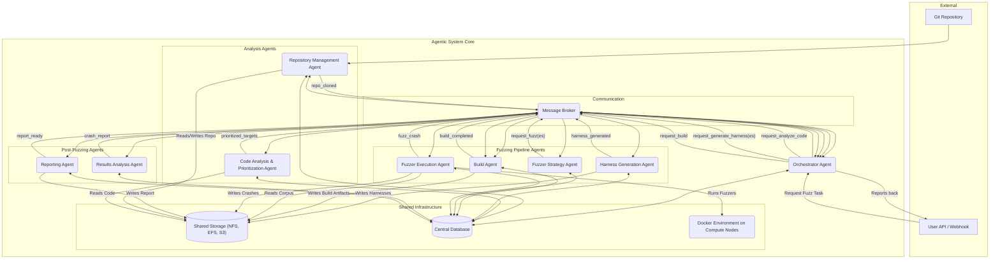

# Agentic-Fuzz-Testing-System

-----

Currently, this is a work in progress inspired by Google's most excellent [oss-fuzz](https://github.com/google/oss-fuzz) "fuzzing/Software As A Service Framework" 
and the [oss-fuzz-gen](https://github.com/google/oss-fuzz-gen) projects which uses GenAI techniques to autogenerate the fuzz test harness.

Among all software security tests (e.g., software composition analysis, static code analysis, malware scans, penetration tests, etc.), fuzz testing is uniquely challenging primarily because one must develop a fuzz test harness for each API or interface identified for fuzz testing. Additionally, analyzing a large codebase to identify and prioritize the relevant APIs/interfaces for fuzz testing is not straightforward. 

This repository will explore how Gemini and/or ChatGPT can assist in dissecting and expanding upon key concepts within current AI/ML-based fuzz testing automation techniques.

-sachin

-----
## Instructions to try and explore the `oss-fuzz-gen` on a local Ubuntu 24.04 host

```text
## Prerequisite 1 -- You need Vertex or OpenAPI keys, and docker in 
#  echo $OPENAI_API_KEY

## Prerequisite 2 -- You need docker - must work without sudo  
#  docker run hello-world

## Prerequisite 3 -- Strict dependency on python3.11 -- Note python3.12 not yet supported in the oss-fuzz env

sudo apt update
sudo apt install software-properties-common -y
sudo add-apt-repository ppa:deadsnakes/ppa -y
sudo apt update
sudo apt install -y python3.11 python3.11-venv binutils # binutils provides c++filt

cd ~
git clone https://github.com/google/oss-fuzz-gen.git
cd oss-fuzz-gen
python3.11 -m venv venv_ossfuzzgen
source venv_ossfuzzgen/bin/activate

pip install --upgrade pip
pip install -e . 

pip install google-adk

## Note: 
## When we installed google-adk, it brings in newer versions of following that are incompatible with `fuzz-introspector`
#    google-api-python-client
#    google-cloud-aiplatform 
#    google-cloud-storage
#    PyYAML
#

## Following changes to `pyproject.toml` are required to reinstall the strict dependencies required for for `oss-fuzz-gen`  

## gedit `pyproject.toml` -- change the  dependencies =[..] section to following
```
dependencies = [
"anthropic==0.31.2",
"chardet==5.2.0",
"cxxfilt==0.3.0",
"GitPython==3.1.43",
"google-api-python-client>=2.143.0",
"google-cloud-aiplatform>=1.64.0",
"google-cloud-storage>=2.9.0",
"google-cloud-logging>=3.11.2",
"Jinja2==3.1.5",
"openai==1.84.0",
"pandas==2.2.2",
"pylint==3.2.5",
"pyright==1.1.345",
"PyYAML>=6.0.1",
"requests==2.32.4",
"rust-demangler==1.0",
"tiktoken==0.9.0",
"yapf==0.40.1",
"fuzz-introspector>=0.1.10"
]
```          
pip install -e . --no-deps

cd ~/oss-fuzz-gen

## `jsmn` (pronounced like 'jasmine') is a minimalistic JSON parser in C. We will fuzz this project.
echo "https://github.com/zserge/jsmn" > input.txt

## cleanup prior stuff just in case
rm -rf work-dir

oss-fuzz-generator generate-full -i input.txt -m gpt-4o -w work-dir
oss-fuzz-generator generate-full -i input.txt -m gpt-4o -w work-dir &> oss_fuzz_gen_log.txt
## Alternatively, use the more traditional syntax (which works in all POSIX shells):
##      oss-fuzz-generator generate-full -i input.txt -m gpt-4o -w work-dir > oss_fuzz_gen_log.txt 2>&1

### To monitor logs, run `tail -f` in a separate shell 
    tail -f oss_fuzz_gen_log.txt
```

-----

## High-Level Design: Agentic Fuzz Testing System

**Goal:** To autonomously fetch a Git repository, **intelligently analyze and prioritize its APIs/interfaces for fuzzing**, **automatically develop fuzz test harnesses for them**, build components with fuzzing instrumentation (specifically LibFuzzer), execute fuzz tests, analyze results, and generate detailed security reports.

**Target Development Environment:** Python 3 on Ubuntu 24.04.

**Key Fuzzing Technologies:** LLVM Clang, LibFuzzer, FuzzDataProvider, Docker for isolated and reproducible builds (mimicking OSS-Fuzz templates).

-----

### I. Planning Phase: Decomposing the Fuzzing Pipeline into Agents

The core of an agentic system lies in breaking down a complex problem into specialized, autonomous components that communicate to achieve a shared goal. Each agent perceives its environment (messages), makes decisions, and performs actions.

**1. Key Agent Roles and Responsibilities:**

  * **1.1. Orchestrator Agent:**
      * **Role:** The "mission control" or workflow manager. Initiates fuzzing tasks for a given repository (e.g., via API request, Git webhook), tracks overall task lifecycle (start, pause, completion, error), and aggregates final results.
      * **Triggers:** `request_fuzz_task` from an external source (e.g., CI/CD, user interface).
      * **Orchestrates:** `request_clone_repo` -\> `request_analyze_code_for_fuzz_targets` -\> `request_generate_harness` (for each target) -\> `request_build` -\> `request_fuzz` (for each compiled fuzzer) -\> `report_ready`.
  * **1.2. Repository Management Agent:**
      * **Role:** Manages all Git operations. Responsible for cloning repositories, checking out specific branches/commits, and making the codebase accessible locally on shared storage.
      * **Perceives:** `request_clone_repo` messages.
      * **Acts:** Executes Git commands (e.g., `git clone`, `git checkout`), informs the Orchestrator (`repo_cloned`) of the local path.
  * **1.3. Code Analysis & Prioritization Agent:**
      * **Role:** Intelligently analyzes the source code to identify significant API/interface entry points, assess their complexity, data sensitivity, external exposure (attack surface), and overall criticality to prioritize what should be fuzzed.
      * **Perceives:** `request_analyze_code_for_fuzz_targets` message (containing `local_repo_path`).
      * **Acts:** Performs static analysis (e.g., AST parsing using LibClang, control flow/data flow analysis), applies heuristics to score and prioritize functions/interfaces, and sends a `prioritized_fuzz_targets` message to the Orchestrator.
  * **1.4. Harness Generation Agent:**
      * **Role:** Automatically develops LibFuzzer-compatible fuzz test harnesses for each identified and prioritized API/interface. This involves understanding function signatures and generating `LLVMFuzzerTestOneInput` functions that call the target API using input from `FuzzedDataProvider`.
      * **Perceives:** `request_generate_harness` messages (containing `local_repo_path`, specific `target_api_definition`).
      * **Acts:** Generates C/C++ source code for fuzz harnesses, writes them into the cloned repository (or a designated temporary location), and informs the Build Agent (`harness_generated`).
  * **1.5. Build Agent:**
      * **Role:** Compiles the project's source code *and the generated fuzz harnesses* with necessary fuzzing instrumentation. Leverages Docker for isolated, reproducible builds using the provided `build.sh` script (similar to OSS-Fuzz).
      * **Perceives:** `request_build` messages (containing `local_repo_path`, `generated_harness_files`, `build_commands`).
      * **Acts:** Spawns Docker containers, executes `build.sh` (which should compile everything with `clang -fsanitize=fuzzer`), captures build logs/errors, identifies compiled fuzzer binaries, and informs the Orchestrator (`build_completed`).
  * **1.6. Fuzzer Strategy Agent:**
      * **Role:** Primarily focuses on parameterizing and preparing the fuzzing runs. It receives the list of *compiled* fuzzer binaries from the Build Agent. It determines fuzzing duration, memory limits, and initial seed corpus locations (if any are provided or generated).
      * **Perceives:** `build_completed` message.
      * **Acts:** Generates and sends `request_fuzz` messages for each fuzzer binary to the Fuzzer Execution Agent.
  * **1.7. Fuzzer Execution Agent:**
      * **Role:** The workhorse of the system. Runs the compiled fuzzer binaries (LibFuzzer) with specified parameters. Manages the fuzzing corpus (input data) and captures any crashes. Designed for high parallelism across multiple compute nodes.
      * **Perceives:** `request_fuzz` messages (containing `fuzzer_binary_path`, `corpus_dir`, `crashes_dir`, `duration_seconds`, `memory_limit_mb`).
      * **Acts:** Executes the fuzzer command, monitors its execution, collects crash inputs and raw stack traces, and sends `fuzz_crash` messages.
  * **1.8. Results Analysis Agent:**
      * **Role:** Processes raw crash data from fuzzers. Deduplicates crashes to identify unique vulnerabilities, extracts detailed, symbolized stack traces (using `llvm-symbolizer`), and potentially enriches findings with more context.
      * **Perceives:** `fuzz_crash` messages.
      * **Acts:** Performs crash analysis, generates unique `crash_report` messages, and sends them to the Reporting Agent.
  * **1.9. Reporting Agent:**
      * **Role:** Aggregates all validated and deduplicated findings. Generates comprehensive security reports in various formats (e.g., HTML, Markdown, JSON). Optionally integrates with external issue trackers (Jira, GitHub Issues).
      * **Perceives:** `crash_report` messages.
      * **Acts:** Compiles a final report, informs the Orchestrator (`report_ready`), and makes the report available.

**2. Multi-Agent Communication Protocol (MCP):**

The MCP defines the "language" and "etiquette" for inter-agent communication. It will be **JSON-based**, transmitted via a centralized **Message Broker**.

**Standard Message Structure:**

```json
{
  "task_id": "uuid4_string",         // Unique ID for the overall fuzzing task
  "sender": "AgentName",             // E.g., "OrchestratorAgent"
  "receiver": "AgentName" | "BROADCAST", // E.g., "BuildAgent"
  "type": "request" | "inform" | "completion" | "error" | "status_update",
  "timestamp": "ISO_8601_datetime",  // When the message was sent
  "content": {
    // This is the payload, specific to the message type and context
  }
}
```

**Key Message Types & Content Examples (Illustrative Flow):**

1.  **Orchestrator initiates:**
      * **`request_fuzz_task`**: `{"repo_url": "...", "commit_id": "..."}` (Internal or external trigger).
      * **`request_clone_repo`**: `{"task_id": "...", "repo_url": "...", "commit_id": "..."}` (Orchestrator -\> RepoManagementAgent).
2.  **Repository Management Agent responds:**
      * **`repo_cloned`**: `{"task_id": "...", "local_repo_path": "/mnt/shared/repos/repo_xyz", "commit_id": "..."}` (RepoManagementAgent -\> Orchestrator).
3.  **Code Analysis & Prioritization Agent operates:**
      * **`request_analyze_code_for_fuzz_targets`**: `{"task_id": "...", "local_repo_path": "..."}` (Orchestrator -\> CodeAnalysisPrioritizationAgent).
      * **`prioritized_fuzz_targets`**: `{"task_id": "...", "targets": [{"function_signature": "...", "file": "...", "priority_score": 0.9, "reason": "..."}, {...}]}` (CodeAnalysisPrioritizationAgent -\> Orchestrator).
4.  **Harness Generation Agent operates:**
      * **`request_generate_harness`**: `{"task_id": "...", "local_repo_path": "...", "target_api": {"function_signature": "...", "file": "..."}, "output_harness_path": "..."}` (Orchestrator -\> HarnessGenerationAgent).
      * **`harness_generated`**: `{"task_id": "...", "local_repo_path": "...", "generated_harness_files": ["fuzz_harnesses/target1_fuzz.c"], "build_artifact_output_dir": "..."}` (HarnessGenerationAgent -\> BuildAgent).
5.  **Build Agent operates:**
      * **`request_build`**: `{"task_id": "...", "local_repo_path": "...", "generated_harness_files": [...], "output_dir": "...", "docker_image": "...", "build_command_args": [...]}` (Orchestrator -\> BuildAgent).
      * **`build_completed`**: `{"task_id": "...", "build_artifact_path": "...", "fuzzer_binaries": ["/path/to/fuzzer1", "/path/to/fuzzer2"]}` (BuildAgent -\> Orchestrator).
6.  **Fuzzer Strategy Agent operates:**
      * **`request_fuzz`**: `{"task_id": "...", "fuzzer_binary_path": "...", "corpus_dir": "...", "crashes_dir": "...", "duration_seconds": 3600, "memory_limit_mb": 2048}` (Fuzzer Strategy Agent -\> Fuzzer Execution Agent).
7.  **Fuzzer Execution Agent operates:**
      * **`fuzz_crash`**: `{"task_id": "...", "fuzzer_binary": "...", "crash_input_path": "...", "stack_trace": "...", "raw_output": "..."}` (Fuzzer Execution Agent -\> ResultsAnalysisAgent).
8.  **Results Analysis Agent operates:**
      * **`crash_report`**: `{"task_id": "...", "fuzzer_binary": "...", "dedup_hash": "...", "vulnerability_type": "...", "severity": "...", "repro_input_path": "...", "symbolized_stack_trace": "..."}` (ResultsAnalysisAgent -\> ReportingAgent).
9.  **Reporting Agent operates:**
      * **`report_ready`**: `{"task_id": "...", "report_path": "/mnt/shared/reports/report_uuid.html", "summary": {"total_crashes": 5, "unique_crashes": 2}}` (ReportingAgent -\> Orchestrator).
10. **Error Handling:**
      * **`error`**: `{"task_id": "...", "agent": "...", "message": "...", "details": "..."}` (Any Agent -\> Orchestrator).

-----

### II. High-Level Design Phase

**1. System Architecture Overview (Enhanced Flow):**



**2. Software Modules (Internal to Agents - Python 3):**

  * **`BaseAgent` (Common Abstraction):**
      * `__init__(name, broker)`: Registers agent with broker.
      * `send_message(receiver, msg_type, content, task_id=None)`: Constructs and sends JSON message via broker.
      * `receive_message()`: Retrieves message from agent's queue in broker.
      * `process_message(message)`: Abstract method, to be overridden by specific agents.
      * `run_cycle()`: The main `perceive -> decide -> act` loop.
  * **Repository Management Agent:**
      * `git_operations.py`: Wrappers for `gitpython` or `subprocess` calls (`clone`, `checkout`).
  * **Code Analysis & Prioritization Agent:**
      * `code_parser.py`: Integrates `clang` (Python bindings for LibClang) to parse C/C++ source into an Abstract Syntax Tree (AST).
      * `analyzer_heuristics.py`: Contains logic to traverse AST, identify function definitions, analyze complexity (e.g., cyclomatic complexity, parameter count, pointer usage), identify I/O operations, string manipulation, and mark functions as potential fuzz targets. Assigns a priority score based on these heuristics and configurable rules (e.g., "network-facing APIs are high priority").
      * `symbol_extractor.py`: (Optional) If parsing compiled binaries for symbols.
  * **Harness Generation Agent:**
      * `harness_template_engine.py`: Uses `Jinja2` or f-strings to generate C/C++ code.
      * `signature_parser.py`: Parses C/C++ function signatures into a structured format (e.g., function name, return type, list of `(param_type, param_name)` tuples).
      * `type_mapper.py`: Maps C/C++ data types to appropriate `FuzzedDataProvider` methods (e.g., `const char*` -\> `ConsumeBytes`, `int` -\> `ConsumeInt32`). Handles struct/class generation if complex types are supported.
      * `harness_writer.py`: Writes generated C/C++ code to the designated `fuzz_harnesses/` directory within the cloned repository.
  * **Build Agent:**
      * `docker_builder.py`: Uses `subprocess` or `docker-py` to execute Docker commands (`build`, `run`). Manages Docker volumes for persistent repo/artifact access.
      * `build_script_executor.py`: Executes the `build.sh` script within the Docker container, capturing logs.
      * `artifact_scanner.py`: Scans the build output directory for compiled fuzzer binaries (e.g., executables linked with `libFuzzer`).
  * **Fuzzer Strategy Agent:**
      * `fuzz_config_generator.py`: Determines optimal fuzzing duration, memory limits, and other `libFuzzer` flags based on target characteristics or available resources.
      * `corpus_manager.py`: (Optional) Logic for managing initial seed corpora (e.g., pulling from a central corpus library, basic generation).
  * **Fuzzer Execution Agent:**
      * `fuzzer_runner.py`: Uses `subprocess` to execute the fuzzer binary (e.g., `./your_fuzzer -max_total_time=3600 -rss_limit_mb=2048 /path/to/corpus/`).
      * `process_monitor.py`: Monitors fuzzer process (PID, CPU, RAM using `psutil`), handles timeouts.
      * `crash_collector.py`: Watches for new crash files in the output directory.
  * **Results Analysis Agent:**
      * `crash_parser.py`: Parses raw fuzzer output and crash files, extracts stack traces.
      * `symbolizer.py`: Uses `subprocess` to call `llvm-symbolizer` or `addr2line` to get human-readable, symbolized stack traces from raw addresses.
      * `deduplicator.py`: Implements logic (e.g., based on normalized stack trace hashes, crash type, or input patterns) to identify unique crashes.
      * `vulnerability_mapper.py`: (Optional) Maps crash types to common weakness enumerations (CWEs) or vulnerability categories.
  * **Reporting Agent:**
      * `report_generator.py`: Collects all unique findings, uses `Jinja2` templates to generate an HTML or Markdown report. Includes sections for summary, unique crashes, reproduction steps, symbolized stack traces.
      * `issue_tracker_integrator.py`: (Optional) Uses REST API clients (e.g., `requests`) to create/update tickets in Jira, GitHub Issues.

**3. API Specifications (MCP Messages & External Interfaces):**

  * **MCP Message Schemas:** As detailed in the Planning Phase (JSON structure). `pydantic` models are highly recommended for robust schema definition and validation.
  * **External Interfaces (CLI / Library Wrappers):**
      * **Git:** `git` command-line utility or `gitpython` library.
      * **Docker:** `docker` command-line utility or `docker-py` library.
      * **LLVM Toolchain:** `clang`, `llvm-symbolizer`, `addr2line` command-line utilities. `clang` (Python bindings for LibClang) for AST parsing.
      * **Build Tools:** `make`, `cmake`, `ninja`, etc. (executed within Docker by `build.sh`).
      * **Fuzzers:** The compiled LibFuzzer binaries themselves (executed via `subprocess`).
      * **External APIs:** Webhook listener for Orchestrator, REST APIs for issue trackers (Jira, GitHub).

**4. Dependency Requirements (Python 3 & Ubuntu 24.04):**

  * **Python Libraries:**
      * `uuid`: For unique task/message IDs.
      * `json`: For message serialization/deserialization.
      * `subprocess`: For executing external commands (Git, Docker, Fuzzers, LLVM tools).
      * `gitpython`: Programmatic Git interactions.
      * `docker-py`: Programmatic Docker interactions.
      * `pydantic`: For defining and validating MCP message schemas (critical for reliability).
      * `redis-py` or `confluent-kafka-python`: For production-grade Message Broker communication (e.g., Redis Pub/Sub, Apache Kafka client). For simulation, `queue` module.
      * `clang`: Python bindings for LibClang (requires `libclang-dev` system package).
      * `Jinja2`: For templated report and harness generation.
      * `psutil`: For process monitoring (CPU, memory, running status) of fuzzers.
      * `requests`: For any HTTP/REST API calls (e.g., to issue trackers).
  * **System-Level Tools (installed on Ubuntu 24.04 compute nodes):**
      * `git`: Command-line tool for repository operations.
      * `docker`: Docker daemon and CLI for containerized builds and fuzzing.
      * **LLVM Clang (latest stable version recommended):** For compiling source code with LibFuzzer instrumentation. (`sudo apt install clang-$(version) lld-$(version) libclang-$(version)-dev`)
      * **LibFuzzer:** Integrated with LLVM Clang.
      * `llvm-symbolizer`, `addr2line`: Essential for symbolizing crash stack traces (part of LLVM utilities).
      * Standard build tools: `make`, `cmake`, `autoconf`, `pkg-config`, `g++` (these will primarily be used *inside* the Docker containers by `build.sh`).
      * Text processing utilities: `grep`, `awk`, `sed` (for parsing logs if not fully structured).

**5. Storage/Compute Infrastructure:**

  * **Storage:**
      * **Persistent Shared File System:** Crucial for all agents to access shared data. This acts as the central workspace.
          * **Contents:** Cloned repositories, generated harness source files, build artifacts (compiled fuzzer binaries, debug symbols, original project binaries), fuzzing corpora (seeds, generated inputs), and raw crash outputs.
          * **Options:** Network File System (NFS) for on-premise, AWS EFS/FSx for Lustre, Azure Files, Google Cloud Filestore for cloud environments. Alternatively, object storage (S3, GCS) with FUSE mounts could work, but performance for frequent small file I/O (like corpus mutations) might need careful evaluation.
      * **Central Database (e.g., PostgreSQL, MongoDB):**
          * **Purpose:** To store structured metadata that is too complex for file system storage or requires querying.
          * **Contents:** Fuzzing task metadata (`task_id`, repo, commit, current status), identified/prioritized API targets, aggregated and deduplicated crash findings, agent operational logs and metrics, historical fuzzing results for trend analysis.
  * **Compute:**
      * **Orchestrator, Repo Management, Fuzzer Strategy, Results Analysis, Reporting Agents:** Can generally run on modest VMs or containers (e.g., 2-4 vCPU, 4-8GB RAM). Their workloads are typically bursty or I/O bound.
      * **Code Analysis & Prioritization Agent:** Can be CPU and RAM intensive, especially for large codebases and deep AST analysis. May require a dedicated, more powerful VM during the analysis phase (e.g., 8-16 vCPU, 16-32GB RAM).
      * **Harness Generation Agent:** Relatively low compute, primarily string manipulation and file I/O. Can share a node with other light agents.
      * **Build Agent:** Requires sufficient CPU and RAM for compilation, especially for large projects and complex build systems. Needs Docker installed. Can be scaled horizontally to handle multiple concurrent builds.
      * **Fuzzer Execution Agent:** This is the most computationally demanding component, designed for horizontal scaling.
          * **High CPU Cores:** Fuzzing is highly parallelizable; each active fuzzer process typically saturates one CPU core. Many cores are needed to run multiple fuzzers concurrently.
          * **Significant RAM:** Fuzzers can consume substantial memory, particularly for complex targets or large corpora.
          * **Design for Elasticity:** Deploy as a scalable cluster (e.g., Kubernetes pods, EC2 Auto Scaling Groups, Google Compute Engine Managed Instance Groups) to run many instances in parallel. Each instance would pick up a `request_fuzz` message, run a fuzzer for its allotted time, and report findings.

-----

### III. Explanation and Justification of the Agentic Approach

This comprehensive agentic design offers significant advantages for automated fuzz testing:

1.  **Modularity and Specialization:** Each agent has a clear, singular responsibility. This simplifies development, testing, and maintenance. If the fuzzing execution logic changes, only the Fuzzer Execution Agent needs modification.
2.  **Scalability:** Each agent can be scaled independently based on its workload. For instance, you can have many Fuzzer Execution Agents running in parallel across hundreds of cores, while only a few Build Agents or one Orchestrator suffice.
3.  **Resilience and Fault Isolation:** If one agent crashes (e.g., a Fuzzer Execution Agent fails), it doesn't bring down the entire system. The Orchestrator can detect errors (via `error` messages or timeouts) and potentially re-queue failed tasks or spawn new agents.
4.  **Loose Coupling via MCP:** Agents interact solely through structured messages via the Message Broker. They don't need direct knowledge of each other's internal implementations. This allows for independent updates, technology changes (e.g., switching from Kafka to Redis as a broker), and even different programming languages for different agents (though Python is specified here).
5.  **Enhanced Intelligence & Automation:**
      * The **Code Analysis & Prioritization Agent** moves beyond simply executing predefined fuzzers to intelligently identifying and ranking the most impactful parts of the codebase to fuzz, optimizing resource usage.
      * The **Harness Generation Agent** automates a historically manual and labor-intensive part of fuzzing, significantly reducing the barrier to entry for testing new APIs and increasing the overall coverage potential. This is a game-changer for large codebases.
6.  **Observability:** The central Message Broker and Database provide a clear audit trail of all actions, states, and data exchanges, making it easier to debug, monitor, and understand the system's behavior.

This plan provides a robust and scalable framework for building a sophisticated agentic fuzz testing system, addressing the complexities of modern software security assurance.
